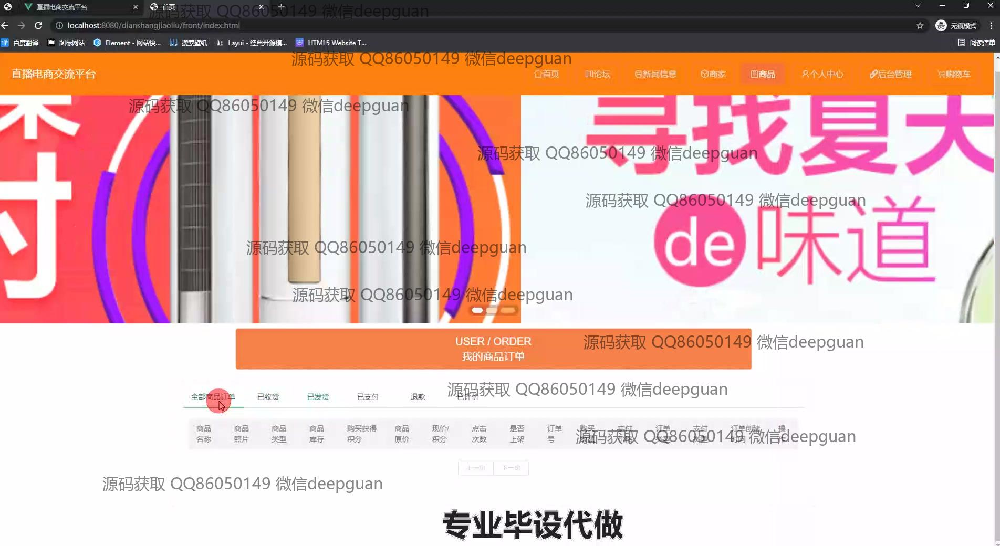

<h1 align="center">基于BS模式的直播电商交流平台+vue</h1>

## 简介
本项目是一个基于BS模式的全功能直播电商交流平台，支持用户和管理员角色。主要功能包括商城、商品管理、订单管理、论坛交互、商品展示和购物车功能，并集成多种在线支付方式，以便实现互动式的电商购物体验。    --计算机毕业设计源码；毕设源码；java毕业设计源码

## 联系方式

<h3 align="center">获取完整代码与数据库文件 + 微信：deepguan QQ: 86050149 QQ群: 783742310</h3>

<h3 align="center">可帮忙远程部署 包运行成功！提供远程部署、修改代码、设计文档指导、代码讲解等服务！</h3>

## 功能介绍（完整见运行截图）
管理员：基本功能包括登录、注册和退出。网站首页提供主导航栏、商品推荐和轮播图展示。商品管理功能涵盖商品列表、搜索、详情查看、购物车管理和订单结算。管理员可以访问后台管理模块，包括公告、新闻信息、商品和用户管理等功能，同时具备商品与订单的修改、删除和添加功能。个人中心允许管理和查看个人信息，实施高效的电商平台管理。

用户：允许执行登录、注册和退出操作，首页设有导航栏、商品推荐与轮播图。用户可浏览商品列表、使用搜索功能、查看商品详情，并管理购物车进行结算。订单管理功能允许查看订单信息及状态，支持订单查询与删除。个人中心提供用户信息修改及查看、订单历史和收藏功能，用户可参与论坛互动，发布帖子与评论。

商家：能够登录系统并维护商品信息。在商品管理模块中，商家可添加和更新商品信息，包括名称、库存、价格等，同时管理商品展示图和订单状态。商家可以查看和管理用户的订单请求，处理发货事宜，并获得销售数据以支持业务决策。商家还可在论坛中发布公告或促销信息，推动品牌宣传和客户互动。

游客：可浏览平台商品与论坛内容，通过主导航栏获取信息，但无法进行购物或互动操作。游客能够查看商品列表、详情和论坛帖子，但须注册为用户以进行购买或参与讨论。网站还提供注册引导，鼓励游客创建账户以成为正式用户，体验更全面的电商交流与购物功能。

## 运行截图

本代码来源于网络,仅供学习参考使用!

